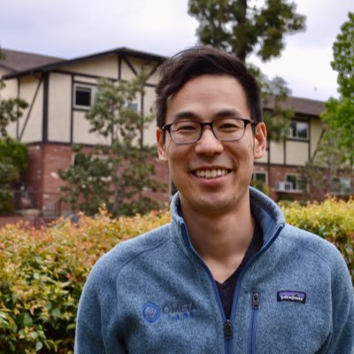

# About Me

I am a computer engineer/scientist/bioinformatician by training. Currently an Assistant Professor in UC Riverside in the Department of Computer Science and Engineering. My research interests are in bioinformatics and more specifically, I focus on computational mass spectrometry. During my graduate studies, I had the honor of being advised by Nuno Bandeira PhD. After my PhD, I did my post-doctoral fellowship work with Pieter C. Dorrestein PhD in the Skaggs School of Pharmacy and Pharmaceutical Sciences. 

## Contact Information

Department of Computer Science and Engineering
 
University of California - Riverside
 
Email: mingxun.wang [at] cs [dot] ucr [dot] edu
